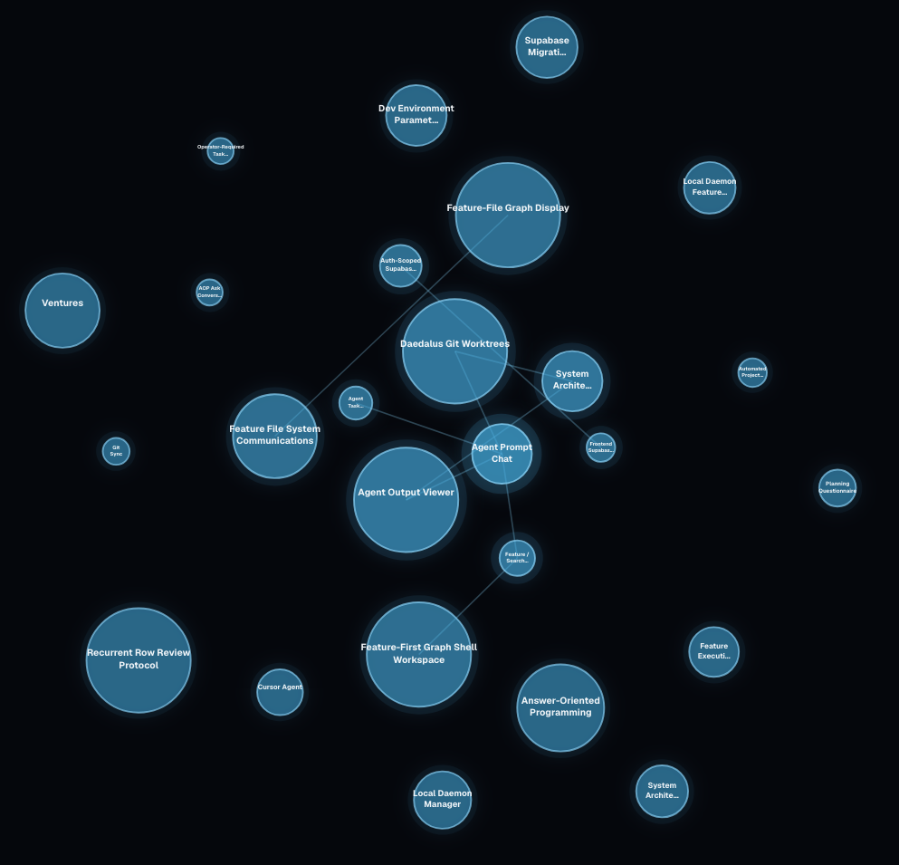

# James Hollingsworth — Projects

## Projects

- [AI Coding Environment](https://github.com/asdfasdasd314/daedalus)
  - Long-term memory, codebase understanding, and multi-agent orchestration for AI coding agents.

- [Prediction Market Trading Bot](https://github.com/wumich15/wfinance)
  - Automated system for identifying and trading price discrepancies across prediction markets.

- [Medley](https://github.com/asdfasdasd314/medley)
  - Personalized music recommendation system that models both musical characteristics and a user's personal associations with songs.

- [Music Chord Classifier](https://github.com/asdfasdasd314/ear-trainer)
  - Program for classifying musical chords from audio in real time.

---

# AI Coding Environment

## Problem Statement

**How can I reduce token usage and bugs when using AI agents to work on large codebases?**

Modern coding agents are effective when given enough context, but providing that context becomes increasingly expensive as a codebase grows. At the same time, agents can introduce bugs when they lack an understanding of how the feature they are modifying relates to the rest of the system.

The goal of this project was to build an environment for coding agents that gives them persistent, structured knowledge of a codebase while minimizing how much raw code needs to be repeatedly placed into their context.

## Key Points

### 1. Some facts are irrelevant, some are vital

When I was coding the prediction market trading system I had this philosophy that all trades *MUST* be hedged. It was imperative so I wouldn't lose money. When I switched conversations though, the agent didn't retain this piece of information and it wrote some code that didn't hedge and lost me $60 (more than 60% of my investment at the time).

I realized that managing these imperative ideas (like always hedging trades) would be so much easier if they could be stored somewhere, like a persisent document, and the agent could read and write from this document in order to keep track of these things.

### 2. Context grows exponentially

This is a well known limitation of transformers, but essentially as more and more prompts are sent in a conversation, the previous context accumulates and is sent with every request becoming very inefficient.

The reason why this necessarily happens is because the AI needs to know what it has done previously. The solution is we can store a summary of each task to let the AI know generally what tasks it has completed. Assuming the rest of the necessary context can be compressed somehow, we can essentially make the token usage constant.

### 3. Independent agents need isolated environments

Running multiple coding agents simultaneously creates another problem: they can modify overlapping parts of the repository.

Git worktrees provide each agent with an isolated working copy and branch while still sharing the same underlying repository. This makes it possible to execute tasks in parallel and merge their changes afterward.

### 4. Merge conflicts can become an agent task themselves

Parallel agents inevitably produce conflicting changes.

Rather than requiring every conflict to be manually resolved, the orchestration layer can provide the conflicting changes and their surrounding context to another agent responsible for reconciling them.

This does not consume significant token usage for the majority of cases since they are simple, but human intervention is allowed in case of repeated failure on complex tasks.

## Final Result

The project is an AI coding environment that combines persistent codebase memory, structured feature representations, Git worktrees, and agent orchestration to provide coding agents with targeted context while allowing multiple agents to work in parallel. The resulting system is designed to reduce redundant token usage and prevent bugs caused by agents operating without sufficient knowledge of the surrounding codebase.

### Example Generated Feature Network

  

  <em>An example network of feature files automatically generated from a codebase. The system breaks the codebase into interconnected features, creating a structured representation that AI agents can use to retrieve relevant context without repeatedly reading the entire repository.</em>

---

# Prediction Market Trading Bot

## Problem Statement

**How can I profit from prices that differ across prediction market exchanges?**

Prediction markets such as Kalshi and Polymarket can offer contracts representing effectively the same underlying event while assigning different prices to those outcomes. When the combined cost of complementary positions across the two exchanges falls below their guaranteed payout, the difference creates a potential arbitrage opportunity.

The goal was to automatically identify these discrepancies and execute both sides of a trade before the opportunity disappeared.

## Key Points

### 1. Taker arbitrage is generally eliminated by fees

Although price discrepancies frequently appear between prediction market exchanges, directly taking both sides of the spread is often unprofitable once trading fees are included. At the same time, spreads in less liquid markets can be large enough to create substantial opportunities for passive orders.

This led to a **hybrid market-making and arbitrage strategy**. The system places maker orders to capture the spread on one exchange, then uses the corresponding market on another exchange to hedge the resulting position when an order is filled.

### 2. Weather markets are well suited to continuous quoting

Weather markets are recurrent, with predictable tickers and similar contracts appearing each day. They also tend to have relatively low trading volume, creating opportunities to provide liquidity rather than compete exclusively for short-lived taker arbitrage.

Because the set of relevant markets can be determined ahead of time, the system can continuously discover and quote these markets while monitoring corresponding contracts across exchanges for hedging opportunities.

### 3. Market data and execution have very different latency requirements

Reading market data is constrained by exchange API rate limits and can involve many relatively slow network requests. Hedging, however, is latency-sensitive: once a maker order fills, the system needs to detect the fill and execute the corresponding hedge as quickly as possible to minimize exposure to price movements.

The system therefore uses an **asynchronous architecture** that separates market-data ingestion and quoting from the latency-sensitive hedging path. Slow or rate-limited data collection can continue concurrently without blocking order monitoring or hedge execution.

Opportunities can disappear between detection and execution. Network latency, API response times, order submission, and order-book changes all affect whether a theoretically profitable trade can actually be captured.

## Final Result

The final system monitors equivalent prediction markets across Kalshi and Polymarket, evaluates cross-exchange price discrepancies, and asynchronously manages limit orders to capture viable arbitrage opportunities. The system was deployed with real capital and generated approximately **$200 in profit**.

---

# Other Projects

## Medley

[View Repository](https://github.com/asdfasdasd314/medley)

Medley is a personalized music recommendation system integrated with the Spotify API. It models both musical properties and personal associations with songs, allowing AI agents to reason about connections such as memories, people, places, moods, and experiences when recommending music.

## Music Chord Classifier

[View Repository](https://github.com/asdfasdasd314/ear-trainer)

A program designed to classify musical chord symbols from audio in real time. The system uses Fourier transforms and audio-processing techniques to convert raw audio into a representation suitable for classification.
